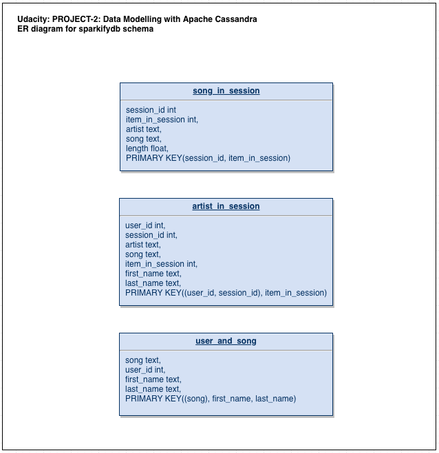

_(Udacity: Data Engineering Nano Degree) | jukka.kansanaho@gmail.com | 2019-04-21_
_This project is a part of [Udacity's Data Engineer Nano Degree](https://eu.udacity.com/course/data-engineer-nanodegree--nd027)._

# PROJECT-2: Data Modelling with Apache Cassandra

## Getting Started

These instructions help you to install and run the project locally. After installing python3 + Apache Cassandra + libraries and dependencies, run from command line:

* `python3 create_tables.py` (to create the DB to Cassandra)
* `python3 etl.py` (to process all the input data to the DB)

---

## Overview

This Project-2 handles data of a music streaming startup, Sparkify. Data set is a set of files in CSV format:

* **./event_data**: event data of service usage e.g. who listened what song, when, where, and with which client

Below, some figures about the data set (results after running the etl.py):

* ./event_data: 30 files (CSV files)
* ./event_data_new.csv: 8056 lines (concatenated input file for DB)
* song_in_session: 6820 rows
* artist_in_session: 6820 rows
* user_and_song: 6618 rows
* Query-1: Faithless, Music Matters (Mark Knight Dub), 495.30731201171875
* Query-2: 4 artists
* Query-3: 3 users

Project builds an ETL pipeline (Extract, Transform, Load) to create the DB and tables, fetch data from CSV files, process the data (combine data ), and insert the the data to DB. As technologies, Project-2 uses python, CQL, Apache Cassandra DB.

---

## About Database

Sparkify event database (called here sparkifydb) schema answers the first set of customer questions:

* _"What artist and song was listened during certain session?"_,
* _"What was the artist, song and user during certain session?"_",
* _"What users have listened certain song?"_

_*SparkifyDB schema as ER Diagram.*_

### Tables

* **song_in_session**: songs and artists in a session (session_id, item_in_session, artist, song, length)
* **artist_in_session**: artist, song, and user in a session (user_id, session_id, artist, song, item_in_session, first_name, last_name)
* **user_and_song**: user listening certain song (song, user_id, first_name, last_name)

---

## HOWTO use

**Project has two scripts:**

* **create_tables.py**: This script drops existing tables and creates new ones.
* **etl.py**: This script uses data in ./event_data, processes it, and inserts the processed data into DB.

### Prerequisites

Python3 is recommended as the environment. The most convenient way to install python is to use Anaconda (https://www.anaconda.com/distribution/) either via GUI or command line.
Also, the following libraries are needed for the python environment to make Jupyter Notebook and Apache Cassandra to work:

* _cassandra_ (+ dependencies) to enable scripts and Jupyter to connect to Apache Cassandra DB.
* _jupyter_ (+ dependencies) to enable Jupyter Notebook.
* _cassandra-driver_ (https://anaconda.org/conda-forge/cassandra-driver) to make Jupyter Notebook and CQL queries to Cassandra work together. NOTE: you may need to install this library from command line.

### Run create_tables.py

Type to command line:

`python3 create_tables.py`

Output: Script writes _"Tables dropped successfully"_ and _"Tables created successfully"_ if all tables were dropped and created without errors.

### Run etl.py

Type to command line:

`python3 etl.py`

Output: Script crawls through all the data directories, tells how many files it has to process, and writes to console the progress of the script as it processes them through. After successfully processing through a directory, script summarised the results:

* _"Adding to filepath list: xyz.csv"_ (listing all files that are added)
* _"xx files found in ./abc123"_ (e.g. event_data)
* _"All xx files processed OK in ./abc123"_ (e.g. event_data)
* _"Total number of rows:"_ (e.g. 10 000)
* _"Input data files filtered successfully to: def456.csv"_ (e.g. event_datafile_new.csv)

## Data cleaning process

`etl.py`works the following way to clean-up and process the source data:

* Sripts crawls through all source data CSV files and combines specified data into a new CSV file.
* From new CSV file, script selects needed data and inserts the data into DB in 3 different tables each used to answer specific questions (queries 1-3).

## Other

Project-2 also contains the following files:

* **Project_2_Project_Notebook.ipynb**: Jupyter Notebook for interactively develop and run python code to be used in etl.py and create_tables.py.
* **test.ipynb**: Jupyter Notebook for interactively run test CQL queries against used DB.
* **Udacity-DEND-Project-2-ERD-20190420v1.png**: ER diagram illustrating sparkifydb table structure.

## Summary

Project-2 provides customer startup Sparkify tools to analyse their service data and help them answer their key business questions like _"What artist and song was listened during certain session?"_, _"What was the artist, song and user during certain session?"_, or _"What users have listened certain song?"_.
